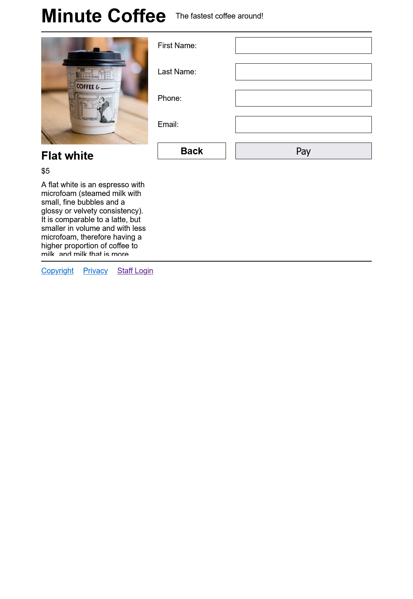
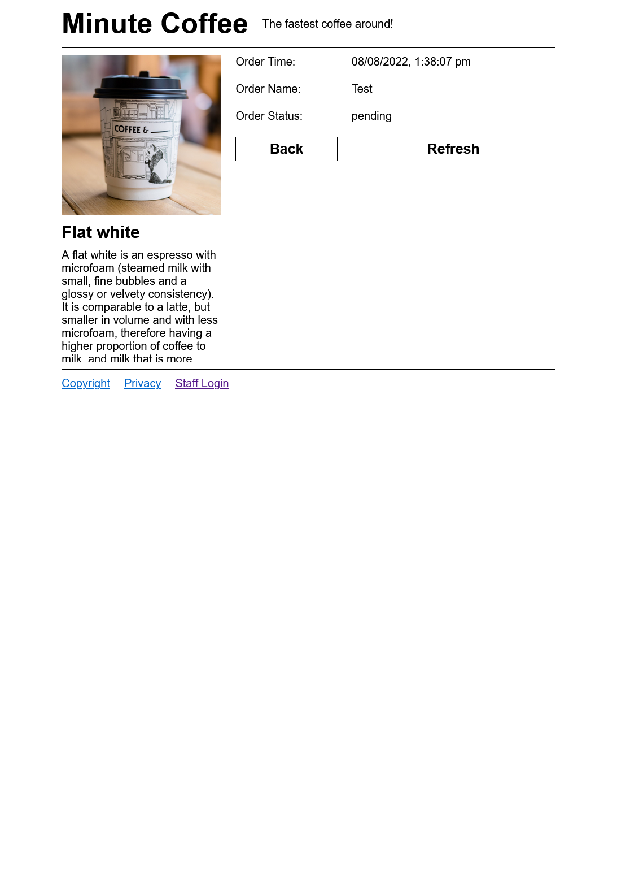
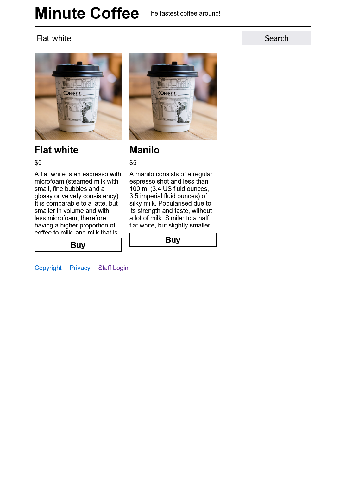
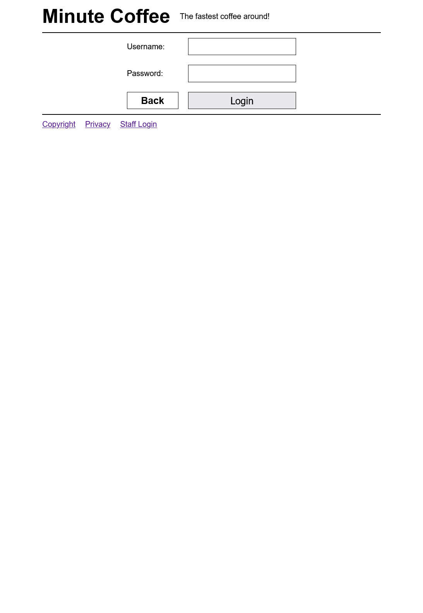
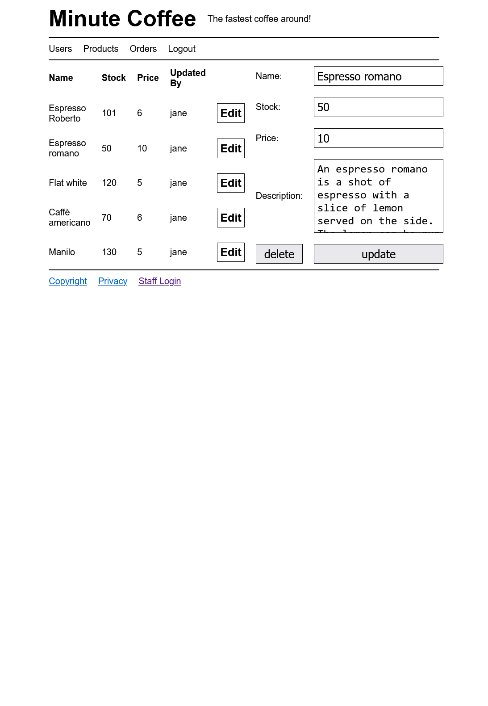

# Minute Coffee

Minute coffee is a dead simple server-side CRUD application that
aims to provide a decent overview of how a traditional server-side
application could be implemented. The project is intended to be used
as scaffolding for first semester web development students.

Do not expect anything to be implemented to best practices or be production ready.

Use and execution of code in this repository is at your own risk.

## Technologies

-   express
-   ejs for page rendering
-   express-session for session state
-   bcrpytjs for password hashing
-   mysql2 for database access

## Wireframes

## Pages

_Customer Pages_

-   Products (Home)
-   Order
-   Confirmation
    _Sales Pages_
-   Order CRUD
    _Stock Pages_
-   Products CRUD
    _Admin Pages_
-   Users CRUD
-   Products CRUD
-   Orders CRUD

### Screenshots

| Screenshots                                          |                                                            |
| ---------------------------------------------------- | ---------------------------------------------------------- |
|      |          |
|  |  |
|          |        |

---

Copyright Jasper Riedel-Rutterford 2022
