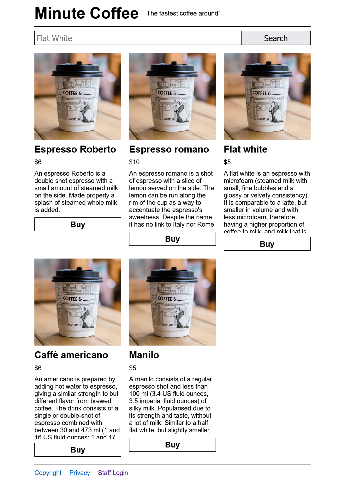
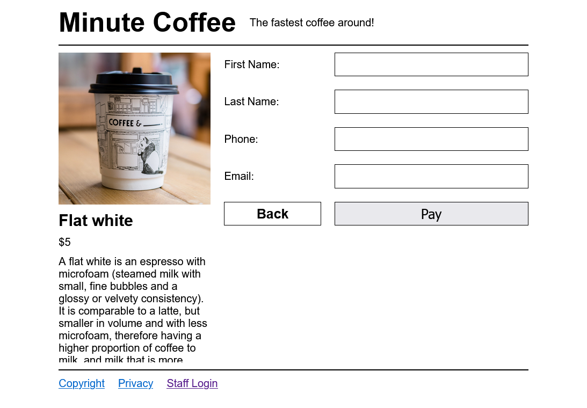
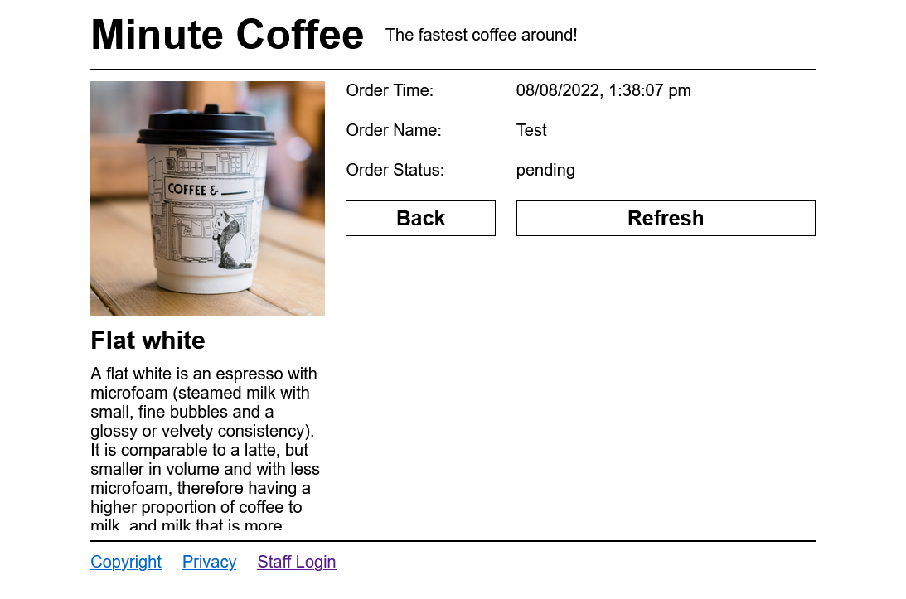
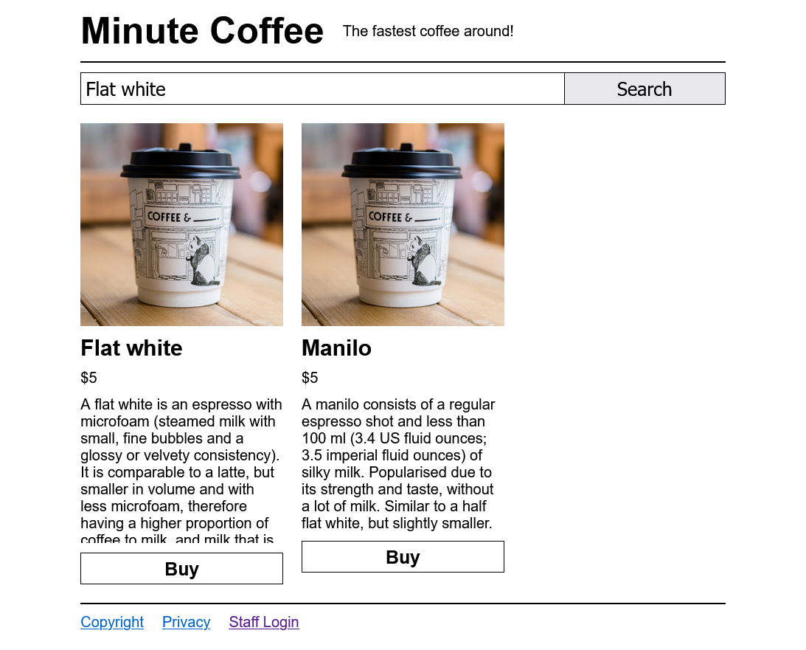
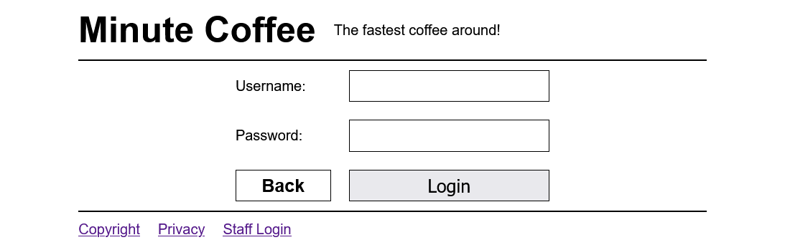
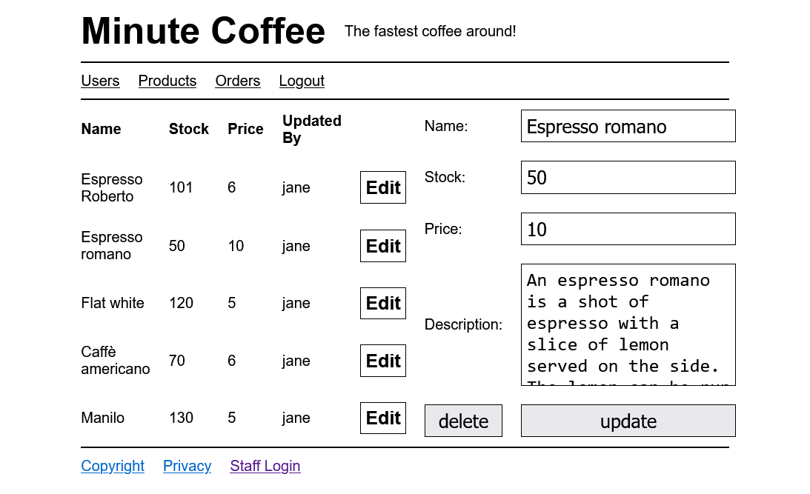
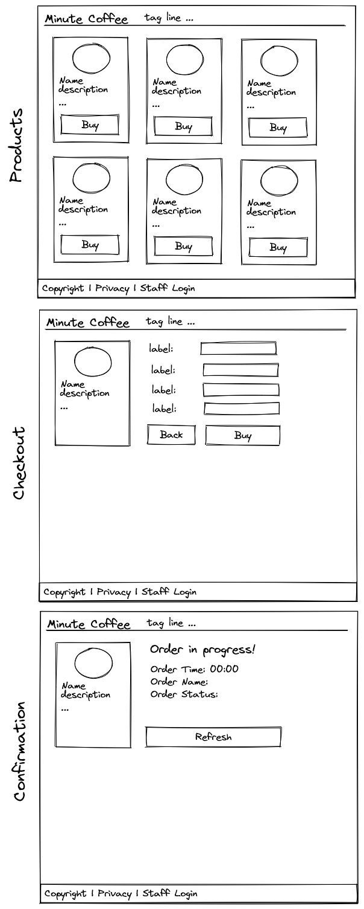

> [!CAUTION]
> This project is being updated for 2025. Functionality is likely broken and the documentation (including this readme) is out of date.

# Minute Coffee

**Minute Coffee** is a straightforward server-side rendered CRUD application designed to provide a basic understanding of how to implement a traditional server-side application in JavaScript. This project is primarily intended as a reference for first-semester web development students in the ICT50220 Diploma program.

Please be aware that this project does not conform to best practices or prioritise production-readiness. Its main objective is simplicity, serving as a teaching tool for fundamental techniques, including form data handling, postbacks, routing, authentication, authorisation, and MVC principles. This makes it ideal for beginners to use as a reference when embarking on their first project.

**Disclaimer:** This source code is provided without any warranty, express or implied. Usage of the resources within this repository is at your own risk.

## Technologies

- [Express](https://www.npmjs.com/package/express): Express is a fast, minimalist web framework for Node.js. It is used in this project to handle routing, middleware, and HTTP request/response management.

- [EJS](https://www.npmjs.com/package/ejs): EJS (Embedded JavaScript) is a simple templating language that enables dynamic HTML page generation. It is utilised here for server-side rendering and creating dynamic web pages.

- [Express-session](https://www.npmjs.com/package/express-session): Express-session is a middleware for handling session state in Express applications. It is employed to manage user sessions and maintain stateful interactions.

- [Bcryptjs](https://www.npmjs.com/package/bcryptjs): Bcryptjs is a library for securely hashing passwords. It is used to hash and store user passwords securely in the database.

- [Mysql2](https://www.npmjs.com/package/mysql2): Mysql2 is a Node.js-based MySQL client library that facilitates interaction with MySQL databases. It is utilised for database access and management in this project.

## Screenshots and wireframe

 

Copyright © Jasper Riedel-Rutterford 2025